# Segmentation de la clientelle 
Mini projet de segmentation de la cleintelle d'une entreprise afin de determiner les 
differentes categories de clients de l'entreprise

### Prerequis
Liste des bibliotheques dont vous aurez besoin pour lancer ce projet.
 Lists : 

 - **pandas** : Utiliser pour la manipulation de DataFrame et le dessin de graphique
 - **numpy** : Utiliser pour les operations matricielles
 - **matplotlib** : Utiliser pour le dessin des graphiques statistiques
 - **seaborn** : Utiliser pour avoir des graphiques statistiques
 - **sklearn** : Utiliser pour entrainer notre modele de k-means

### Instalation de bibliotheque

Pour installer une bibliotheque utiliser le  gestionnaire de package python `pip`
taper <strong>pip install <nom du package></strong>

## Utilite

Ce projet permet a qui le veut d'avoir une grande idees sur la demarche 
a suivre pour la demarche a suivre pour segmenter les clients d'une entreprise
en utilisant les outils statistiques d'analyse tel que le coeficient de pearson et l'utilisation de la methode de <strong>coude</strong> et <strong>kmeans</strong>

## Images du projet

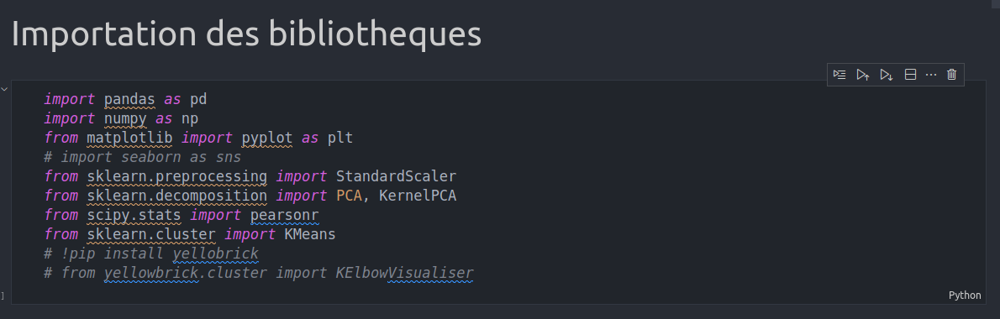
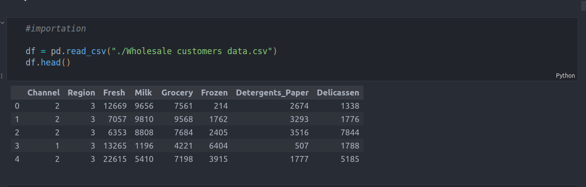
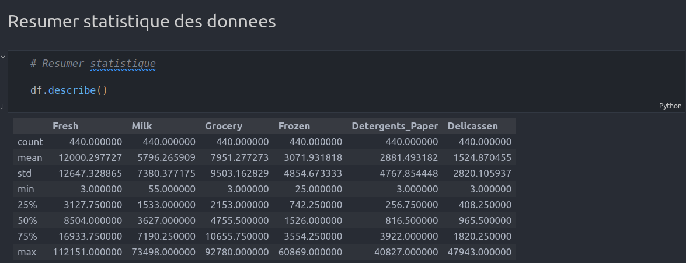
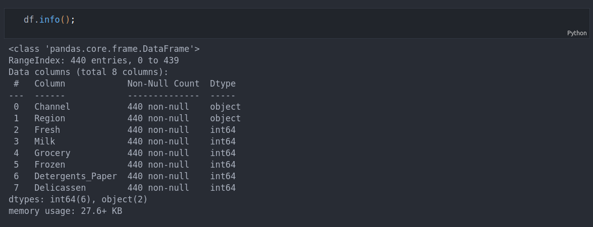
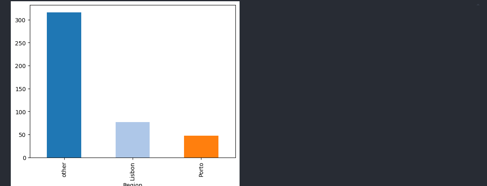
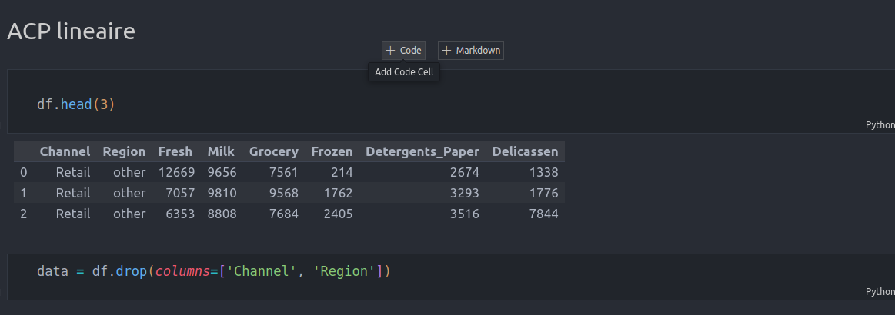
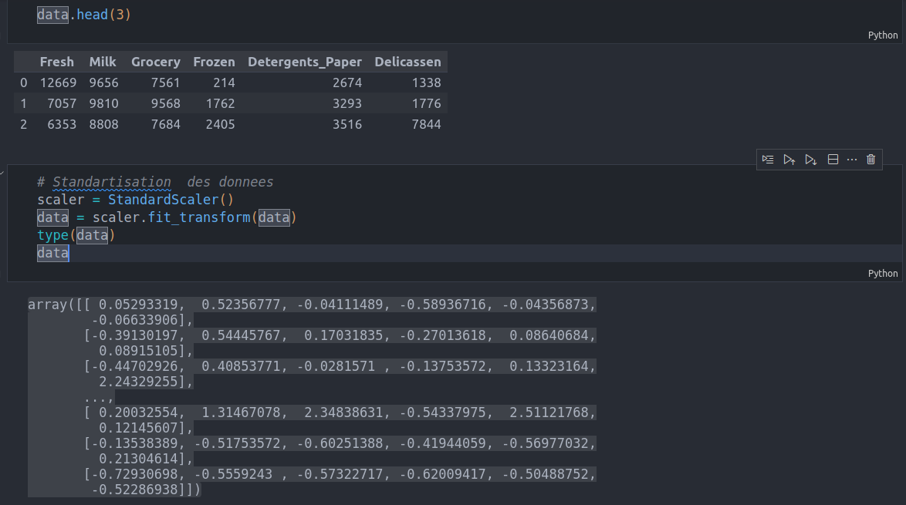
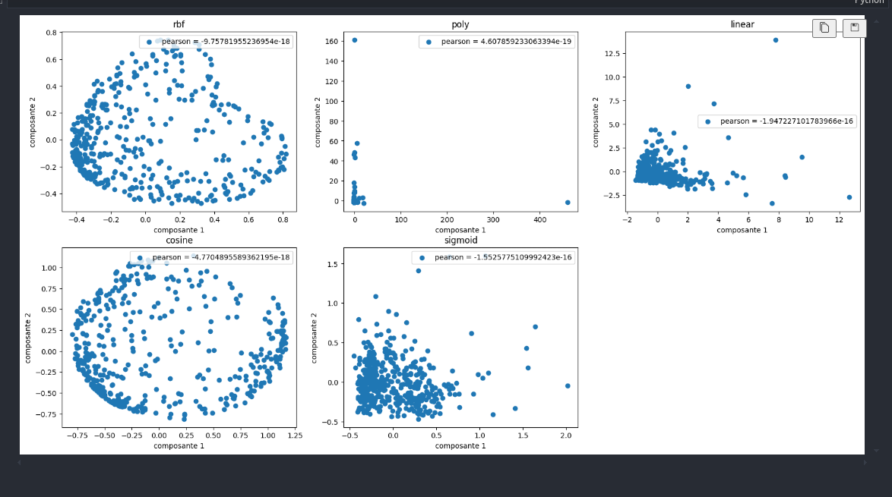
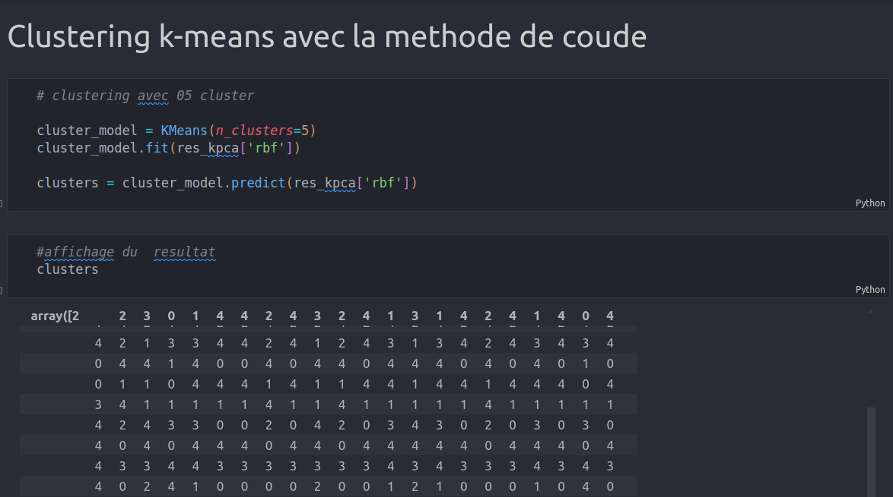
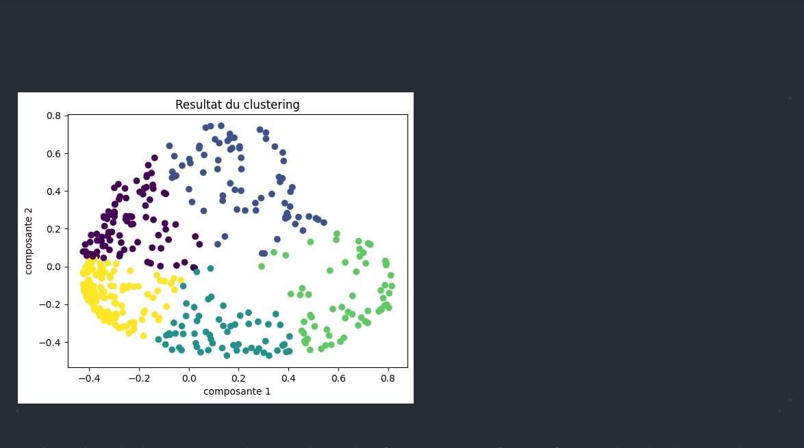
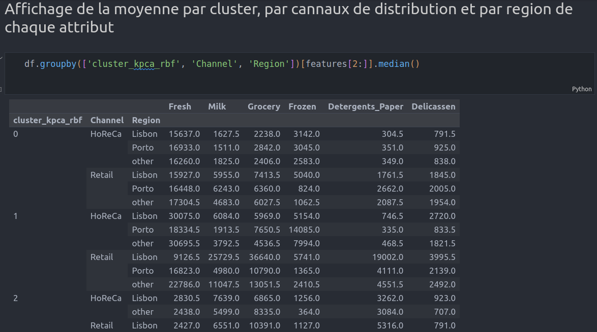